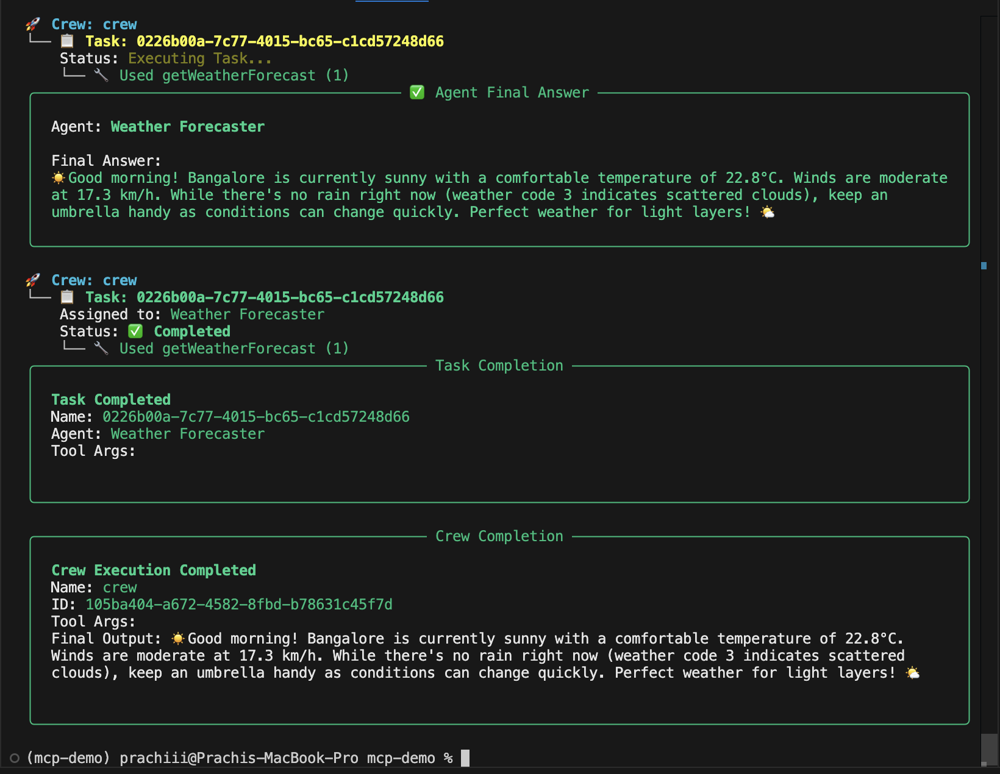

# MCP Demo Project

This project demonstrates how to connect to an MCP server using the Streamable HTTP Transport protocol and how an agent can call MCP tools to perform tasks such as retrieving weather information.

## Setup

1. **Clone the repository and navigate to the project folder:**
   ```sh
   git clone <repo-url>
   ```

2. **Install dependencies:**
   ```sh
   uv add -r requirements.txt
   ```

   OR

   ```sh
   pip install -r requirements.txt
   ```

3. **Configure environment variables:**
   - Create a `.env` file in the project root.
   - Add your API keys (e.g., for OpenAI):
     ```
     OPENAI_API_KEY=your-openai-key-here
     ```

## How It Works

### 1. Connect to MCP Server

The project uses `MCPServerAdapter` to connect to your MCP server via Streamable HTTP:

```python
server_params = {
    "url": "http://localhost:8082/weather/mcp",
    "transport": "streamable-http"
}

with MCPServerAdapter(server_params) as tools:
    # tools are now available for the agent
```

### 2. Discover and Use MCP Tools

The agent discovers available tools from the MCP server (e.g., `getWeatherForecast`) and can call them by passing the required arguments:

```python
weather_tool = next((tool for tool in tools if tool.name == "getWeatherForecast"), None)
result = weather_tool.run(
    latitude=12.9716,
    longitude=77.5946,
    current_weather=True
)
```

### 3. Agent and Task Execution

An agent is created with access to the MCP tools. You define a task describing what the agent should do (e.g., "Get the current weather in Bangalore"):

```python
http_agent = Agent(
    role="Weather Forecaster",
    goal="Provide current weather information for any city.",
    tools=[weather_tool],
    verbose=True,
)

http_task = Task(
    description="Get the current weather in Bangalore using the getWeatherForecast tool.",
    expected_output="Current weather details for Bangalore.",
    agent=http_agent,
)
```

The crew executes the task and returns the result:

```python
http_crew = Crew(
    agents=[http_agent],
    tasks=[http_task],
    verbose=True,
    process=Process.sequential
)

result = http_crew.kickoff()
```
## Output



## Summary

- Connects to MCP server via Streamable HTTP Transport using CrewAI.
- Discovers and uses MCP tools.
- Agent performs tasks by calling MCP tools with required arguments.
